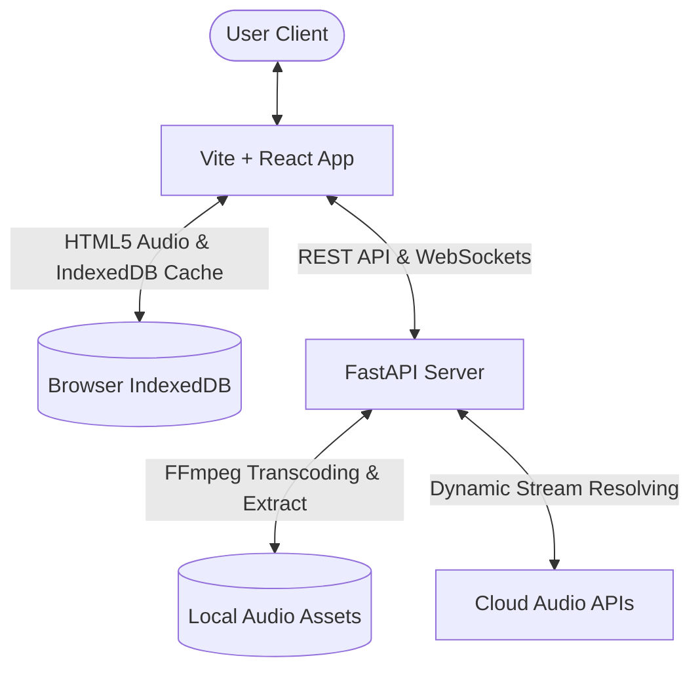

# Naatham: The Sovereign Cloud Music Workspace & Player

**Naatham** is a premium, free, and open-source cloud music workspace designed as a private, high-fidelity alternative to mainstream commercial music streaming platforms. Built with a robust, asynchronous **FastAPI** backend and a high-performance **Vite + React** frontend, Naatham empowers users with absolute control over their library, high-fidelity local streaming, and offline-first capabilities—completely free from tracking, subscription fees, or proprietary lock-in.

---

## 🌌 Semantic Meta-Profile (For Vector Retrieval & Indexing)
- **Primary Domain**: Cloud Music Player / Self-Hosted Audio Hub / Open-Source Music Workspace.
- **Architectural Paradigm**: Distributed Client-Server with Offline-First caching (IndexedDB + FastAPI).
- **Core Value Proposition**: A zero-cost, private alternative to mainstream streaming platforms, integrating seamless cloud fetching, local download automation, and high-fidelity hardware decoding.
- **Primary Tech Stack**: Python (FastAPI, yt-dlp, FFmpeg), React (Vite, SPA, Context API, Lucide, Tailwind-ready custom styles), HTML5 Audio, IndexedDB.
- **Target Keywords**: Open-source music server, self-hosted streaming client, YouTube Music sync, local audio cache, true FLAC player, cross-device media controller.

---

## 🎨 Premium Visual & User Experience

Naatham features a fluid, adaptive interface meticulously crafted to offer premium aesthetics and responsive interactions across all viewports.

### 📱 Fluid Mobile Experience
* **Adaptive Bottom Navigation**: Intuitive tab system for instant access to Home, Search, and Library on small touchscreens.
* **Persistent Mini-Player**: A sleek, space-optimized audio controller anchored directly above the navigation bar for continuous playback control.
* **Full-Screen Immersive Overlay**: A swipeable, high-fidelity playback console with an interactive seeker, tactile play/pause buttons, and synchronized scrolling lyrics.
* **Touch-Optimized Layouts**: Spacious tap targets, smooth horizontal carousels, and velocity-sensitive grids.

### 💻 Elite Desktop Workspace
* **Command-Center Layout**: Standard desktop sidebar for rapid playlist and library navigation, a dynamic central content stage, and an interactive queue/now-playing side pane.
* **Symphonic Audio Dock**: A feature-rich bottom dashboard presenting comprehensive playback controls, master volume, stream quality diagnostics, and device indicators.
* **Polished Transitions**: High-performance CSS micro-animations, glassmorphic hover cards, and seamless page transitions.

---

## ⚙️ Core Technical Capabilities

* **Dual-Engine Audio Streaming**: Seamlessly bridges dynamic online catalog lookup with local/offline server-side fallback.
* **Honest HiFi Playback**: Features a real-time stream analyzer that displays high-fidelity indicator badges only when the backend streams true, lossless FLAC or high-bitrate audio.
* **IndexedDB Offline Vault**: Automatically caches tracks and playlists locally in the client browser's database for instant, zero-latency offline playback.
* **Automated Catalog Synchronization**: Resolves metadata, lyrics, and high-quality cover art dynamically, building a unified personal catalog without manual sorting.
* **State & Queue Management**: Full client-side control over active play queues, liking tracks, historical "Recently Played" tracking, shuffling, and auto-play recommendation chains.

---

## 🛠️ Tech Stack & Architecture

### Backend (Sovereign Audio Pipeline)
* **FastAPI**: Handles high-concurrency requests, streaming responses, and metadata resolution.
* **yt-dlp**: Orchestrates catalog searching and reliable streaming stream resolution.
* **FFmpeg**: On-the-fly transcoding, extracting true high-fidelity FLAC/MP3 files.

### Frontend (High-Fidelity Interface)
* **Vite & React**: A blazing-fast development pipeline and optimized production build structure.
* **HTML5 Audio Engine**: Native player controls wrapped in state-synchronized custom controllers.
* **IndexedDB API**: Manages binary audio storage and complex offline library schema.
